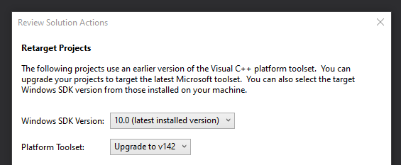
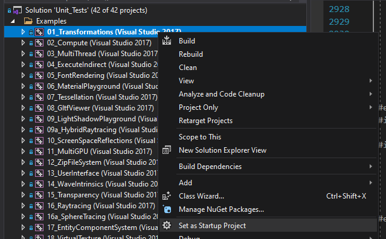
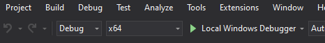
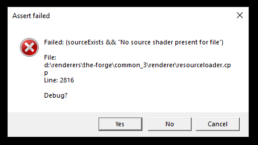

# Building TheForge

ConfettiFX provides IDE project files for each of the platforms it supports. These are located in [`Examples_3/Unit_Tests/YOUR_PLATFORM`](https://github.com/ConfettiFX/The-Forge/tree/master/Examples_3/Unit_Tests). For free we have access to (other platforms are only available for accredited developers) :

- XCode for MacOS
- Visual Studio 2017 for Android ([can be upgraded to 2019 on open](https://github.com/ConfettiFX/The-Forge/issues/137))
- Visual Studio 2017 for Windows ([can be upgraded to 2019 on open](https://github.com/ConfettiFX/The-Forge/issues/137))
- Codeline for Linux

The project do not officially support project generator tools such as [CMake](https://cmake.org/), [Premake](https://premake.github.io/) or even [Sharpmake](https://github.com/ubisoft/Sharpmake), which means that it can be cumberstone to create a new project or integrate the library into your pipeline.

As an open-source project, the community have since created more streamlined version of the library to use standard project generation. You have the multiple choice to build our samples :

## `Option 1:` Use our custom, simplified project

We provide a repository called <a href="https://github.com/learn-computer-graphics/the-forge-samples" target="_blank">The-Forge-Samples</a> from which you will find detailed build instruction for your platform. It uses CMake for project generation so you will be able to generate project file for your favorite IDE.

> Please note that we have to upgrade this project to the latest version of TheForge, there are only a few API changes

## `Option 2:` Use the official TheForge repository

As explained above, ConfettiFX provides project files for some IDEs which works just fine. Yet If you want to create another project from it there are multiple configuration steps to do. 

We will focus on the Windows platform as it is the most used, but the setup will be equivalent for the Other IDEs. 

### Prerequisites (Windows)

You need to install [Visual Studio](https://visualstudio.microsoft.com/fr/) and select the "Desktop development with C++" package.


Then you can download The-Forge project from <a href="https://github.com/ConfettiFX/The-Forge/releases/tag/v1.48" target="_blank">their repository</a>. Either as a .zip file or by running `git clone https://github.com/ConfettiFX/The-Forge.git`. We tested it with the version 1.48.


To run the unit test, you have to download the assets used by the examples. To do so simply run the `PRE_BUILD.bat` file. Then open the Visual Studio project located in `The-Forge\Examples_3\Unit_Tests\PC Visual Studio 2017\Unit_Tests.sln`. You will probably have a more recent visual studio version, so you will have a popup to upgrade the project. Do not change the settings and press "Ok".



In the "Solution Explorer" window (if not available, use the top dropdown View->Solution Explorer), right click on `Examples\01_Transformations` and set it as Startup Project.



Finally, on the upper window select build config to `Debug` in `x64` and launch by clicking on "Local Windows Debugger". It will take some time to build.



If everything went well the following window with the animated solar system should open :


Now if you want to follow along our tutorial from TheForge official repository there are essentially two ways to go :

### `Option A:` Modify an existing example

Simply remove the content of the .cpp file of an Unit Test of your choice and follow the tutorial. There might be other things to change, such as shader files or resource files.

### `Option B:` Create a new Visual Studio project inside the unit test solution

#### 1. Create a new project

In the Solution Explorer, right click in the Examples folder and click on Add->New Project...


Select an Empty Project C++ in the templates. You will be able then to set the Project name and its location. It is recommended to put it along the other Unit Tests in the `PC Visual Studio 2017` folder. You can now press Create.


Because Visual Studio will create a new folder, and TheForge other samples are in the same folder, we need to manually remove, move and add the project so that it uses the same folder as the other samples (it is possible to do otherwise, but it means that we would need to adapt the path of some commands).

| Step 1 : Remove our custom project     | Step 2 : Close visual studio and move the custom project in the folder above | Step 3 : Open visual studio and add as existing project |
| -------------------------------------- | ------------------------------------------------------------ | ------------------------------------------------------- |
|  |                        |                   |

#### 2. Add source files

The project is empty, so it is time to add the source files. Right click on the "Source Files" folder of your new project and select "New Item..."


Change the location of your new .cpp source file in the `src` folder inside a new folder you have to create


Your file will be empty, so you can copy the content of `01_Transformations.cpp` to get started. If you set your project as a startup project and try to build it you will encounter some build errors, either because files or function definition are not found. We need to configure the library links.

#### 3. Link Libraries

Right click on your new project and select Properties :


In `Configuration Properties/C/C++/Preprocessor` set the Preprocessor Definitions value to :

```
USE_MEMORY_TRACKING;_DEBUG;_WINDOWS;VULKAN;DIRECT3D12;DIRECT3D11;%(PreprocessorDefinitions)
```

Select in `Configuration` the All Configurations value.


In `Configuration Properties/VC++ Directories`. Set Include Directories value to :

```
$(VULKAN_SDK)\Include;$(IncludePath)
```

And the Library Directories value to :

```
$(SolutionDir)\$(Platform)\$(Configuration);$(VULKAN_SDK)\Lib;$(LibraryPath)
```

In `Configuration Properties/Linker/Input`. Set the Additional Dependencies value to :

```
LuaManager.lib;Xinput9_1_0.lib;ws2_32.lib;gainputstatic.lib;Renderer.lib;OS.lib;%(AdditionalDependencies)
```

Save and exit. Now open the solution properties on right clicking on the Solution 'Unit_Tests' and go to `Common Properties/Project Dependencies`. Select your custom project and check the tickboxes for gainputstatic, LuaManager, OS, Renderer and SpirvTools.


Set your project as startup project and try to build, it should work. If you encounter build error, look at the properties of one of the sample by clicking on the project and compare with you values. If you try to launch the project you will encounter an assert and it will crash. That's because the needed runtime dependencies are not located next to the executable. We will fix this in the next step.


#### 4. Post-build commands to copy resources to build folder

Open your project option and in `Configuration Properties/Build Events/Post-build Event` in the command line field, click on the bottom arrow, select "<Edit ...>" and paste those lines :

```bash
xcopy /Y /S /D "$(ProjectDir)..\UnitTestResources\Textures\Skybox_*.dds" "$(OutDir)Textures\"
xcopy /Y /S /D "$(ProjectDir)..\UnitTestResources\Textures\circlepad.dds" "$(OutDir)Textures\"
xcopy /Y /S /D "$(ProjectDir)..\UnitTestResources\Fonts\*.ttf" "$(OutDir)Fonts\"
xcopy /Y /S /D "$(ProjectDir)..\UnitTestResources\Fonts\*.otf" "$(OutDir)Fonts\"

xcopy /Y /S /D "$(OutDir)..\OS\Shaders\VULKAN\*.*" "$(OutDir)Shaders\VULKAN\"
xcopy /Y /S /D "$(OutDir)..\OS\Shaders\DIRECT3D11\*.*" "$(OutDir)Shaders\DIRECT3D11\"
xcopy /Y /S /D "$(OutDir)..\OS\Shaders\DIRECT3D12\*.*" "$(OutDir)Shaders\DIRECT3D12\"

xcopy /Y /S /D "$(ProjectDir)..\src\$(ProjectName)\GPUCfg\*.*" "$(OutDir)GPUCfg\"
xcopy /Y /S /D "$(ProjectDir)..\UnitTestResources\Scripts\*.lua" "$(OutDir)Scripts\"

xcopy /Y /D "$(SolutionDir)$(Platform)\$(Configuration)\*.dll" "$(OutDir)"
```

Then in `Configuration Properties/General` set the Output directory to :

```
$(SolutionDir)$(Platform)\$(Configuration)\$(ProjectName)\
```

And the Intermediate Directory to :

```
$(SolutionDir)\$(Platform)\$(Configuration)\Intermediate\$(ProjectName)\
```

Now you can build and run. There will be another assertion triggered, this time it is because the shader files specific for this project are not found.



#### 5. Add the shaders

Open your file explorer and copy the `GPUCfg` and `Shaders` folders located in `Examples_3/Unit_Tests/src/01_Transformations` into your custom folder in `src`. Then you can add it to Visual Studio, to do so, start by creating a new virtual folder by right clicking on your custom project and select Add->New filter, and name it Shaders.


Add the .fls shader files by right clicking on the folder and select Add->Existing Item...


You can now navigate in your custom folder in the `src` folder and select the files. These .fsl stands for Forge Shading Language, which is a superset of DirectX's HLSL that can be transpiled into other shading languages such as .glsl.


You now have to allow visual studio to recognize these file extensions. Close visual studio and open your `MY_CUSTOM_PROJECT.vcxproj` and add right after the line `<ImportGroup Label="ExtensionTargets">` located towards the end this line :

```xml
<Import Project="..\..\..\Common_3\Tools\ForgeShadingLanguage\VS\fsl.targets" />
```

You can save, open visual studio and open the properties of all of your shader files.


 As their Item Type, you can now set FSLShader.


If you press Apply you will see that a new tab called FSLShader is available, click on it and set the `Language ` value to `VULKAN DIRECT3D11 DIRECT3D12`, the `OutDir` value to `$(OutDir)/Shaders/` and finally the `BinaryOutDir` value to `$(OutDir)/Shaders/Binary`. Save and exit the window.


If you build again and launch, everything should work properly and you should see the same scene as the first UnitTest. Great ! Know that you know how to setup a project from scratch, you can change it to the way you want and follow the tutorials this way, Good luck !


